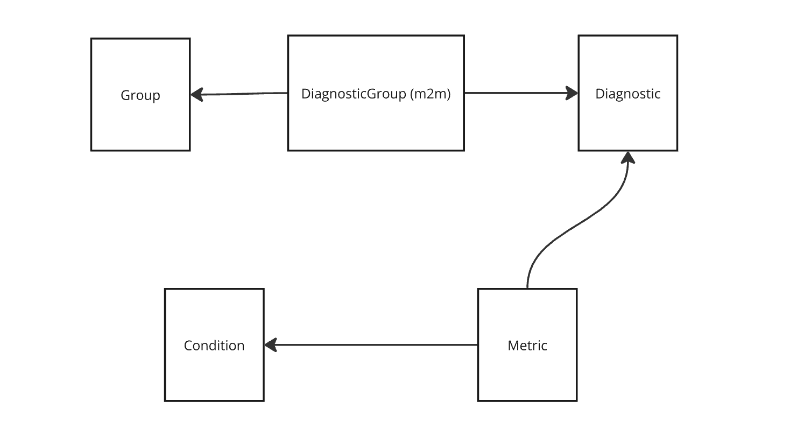

# Everlab

## Instructions:

```sh
docker-compose up -d
pnpm install
pnpm dev

pnpm test-unit # run unit tests
```

## Starting points for review:

- Backend:
  - DB Schema: `prisma/schema.prisma`
  - Seed csv files: `prisma/seed.ts`
  - API endpoint: `src/server/routers/analyse.ts`
- Frontend:
  - Home page/Upload page: `src/pages/index.tsx`
  - Analysis page: `src/pages/analysis.tsx`

## Data Diagnosis:

- Some of the queries run:

  ```sql
  SELECT name, COUNT(*) AS count
  FROM './prisma/data/diagnostic_metrics.csv'
  GROUP BY name
  HAVING COUNT(*) > 1;

  SELECT *
  FROM './prisma/data/diagnostic_metrics.csv'
  WHERE oru_sonic_units ILIKE '%;%';

  WITH all_pairs AS (
    SELECT name, TRIM(unnested.value) AS metric
    FROM read_csv_auto('prisma/data/conditions.csv'
  ), UNNEST(string_split(diagnostic_metrics, ',')) AS unnested(value))
  SELECT
    metric,
    COUNT(DISTINCT name) AS condition_count,
    LIST(name) AS conditions
  FROM all_pairs
  GROUP BY metric
  ORDER BY condition_count DESC;
  ```

- `Total Serum IgA` is found as a duplicate. All fields are the same. Except `diagnostic` and `diagnostic_groups`, therefore need to give priority to metrics that have a `diagnostic` and `diagnostic_groups` field
  - Did not implement this as this value is not in the sample oru file, but needs to be implemented in a production setting
- All units in `oru_sonic_units` for each metric are equivalent to `units`
- No metric has different units, but need to cater for the possibility
- Will go ahead with the assumption that if new units are to be used, new records will be added to `diagnostic_metrics.csv` where the metric name will be the same but the units will be different
- min_age and max_age are always whole numbers (integers)
- `diagnostic` and `group` have an m2m relationship
- `metric` has 1 `diagnostic` and therefore it is a 1:m relationship
- Can a `metric` have multiple conditions? As per the queries run above, no. Therefore it's a 1:m relationship
- `conditions.csv` doesn't specify whether the condition is present if the metric value is above the maximum, or below the minimum. I will assume that the condition is present either way
- Possible issues (won't investigate, but should investigate in a production setting):
  - There is duplication of relationships which might introduce inconsistencies. Example: `diagnostic_groups.csv` has a `diagnostics` column. `diagnostics.csv` also has a `diagnostic_groups` column. There are many more examples of this. For this exercise, wherever there are multiple ways to traverse a relationship, I will choose one and ignore the rest. In a production setting though, data integrity should be ensured before loading such files.
- The `diagnostics.csv` file should have all the data that `diagnostic_groups.csv` and `diagnostics.csv` have:
  - It contains the `diagnostic_groups` and `diagnostic` columns with which you could derive the mapping between `diagnostic`, `group` and `metric`
  - This is <mark>ASSUMING</mark> perfect data integrity between the files. This should be verified in a production setting.
  - This is also due to the fact that the ORU file refers to metrics, therefore if there exists a group or diagnostic that doesn't have a metric, it is not relevant to the ORU file. Therefore, it is safe to ignore
  - From the above, it then follows that I need to only load `diagnostic_metrics.csv` and `conditions.csv` files, leading to:
    1. A simpler implementation
    1. Stronger data integrity guarantees
- assuming `group`, `diagnostic` and `condition` have unique names across the board. Same goes for `metric` except when multiple units are to be used
- min_age of 0 and max_age of 200 means they were not specified
- Not all metrics have a `condition` associated with them.
- Although the instructions specify that you should match on metric age range, gender oru_sonic_units and oru_sonic_codes, there only exists one metric for 1 of these combinations
- Assuming min_age, max_age, everlab_lower, everlab_higher, standard_lower and standard_higher are all inclusive
- Assuming if stardard_lower or everlab_lower is null or 0, that there is no lower limit

##### DB Graph



## ORU Format Diganosis

- The hl7 version used is 2.3 as can be seen inside the file
- Used the corresponding dictionary for the version from https://github.com/fernandojsg/hl7-dictionary
- To handle the oru file properly in a production settings, a lot more will have to be done:
  - Handling different versions
  - Reading different value types
  - etc
